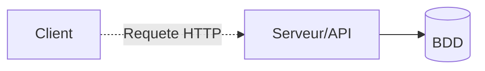

## Architecture générale
 
L’application repose sur une architecture logicielle de type client-serveur : séparation entre la partie visible par l’utilisateur (le front-end / client) de la partie métier et des traitements de données (le back-end / serveur).

Les deux couches communiquent via une api "REST" (Representational State Transfer) 

Ici, transfert de données au format *JSON* via des requêtes et réponses HTTP (GET, POST, PUT, DELETE)

 

