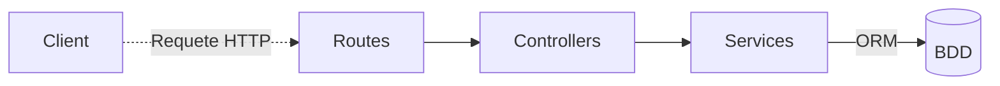

## Serveur
- Langage: Javascript
- Runtime: NodeJS 
- Framework : ExpressJS 

Utilisation de la fonction "watch" de nodeJS pour l'environnement de dev.

Fonctionnement:

```mermaid
flowchart LR
  1[Client]-."Requete HTTP".->2[Routes]-->3[Controllers]-->4[Services]--"ORM"-->5[(BDD)];
```